# 深度学习
## 〇、预备
### 损失函数：
1. softmax函数
2. 交叉熵函数
## 一、多层感知机MLP
多层感知机:多层感知机由多层神经元组成，最简单的深度网络。
### 感知机
只能做二分类问题（只能产生线性分割面？）。
- 决策定理：
 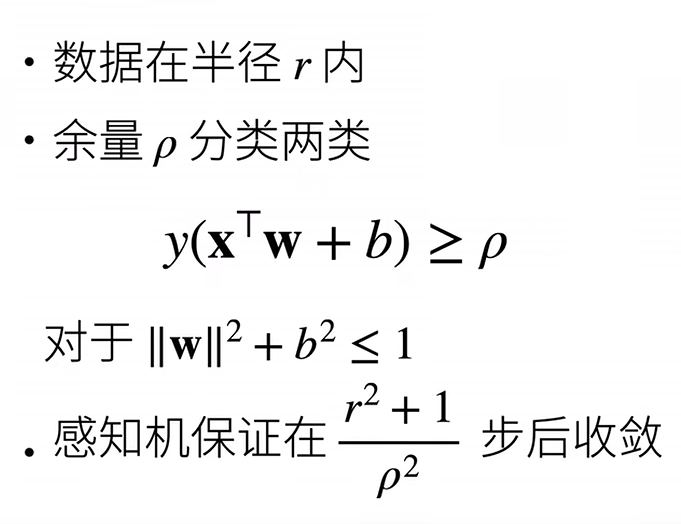
### 多层感知机
#### 激活函数：
 - sigmoid函数
  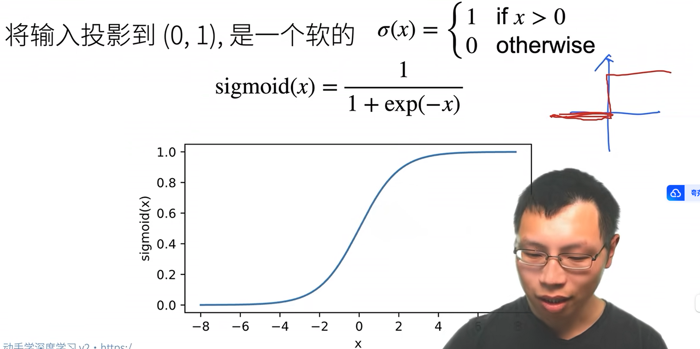
 - tanh函数
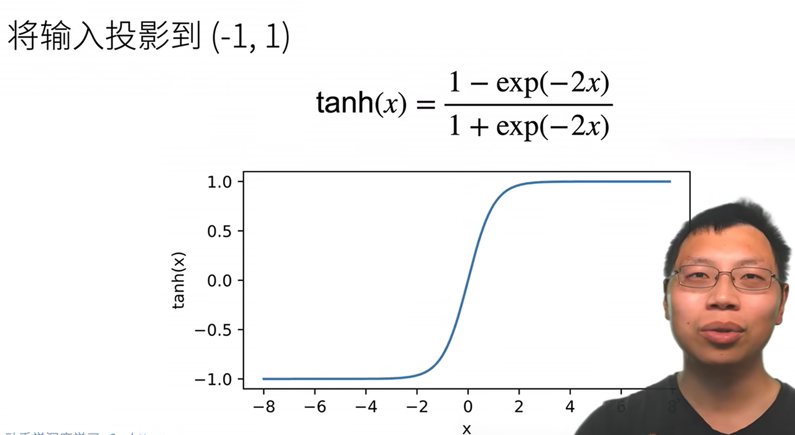
- RELU函数
 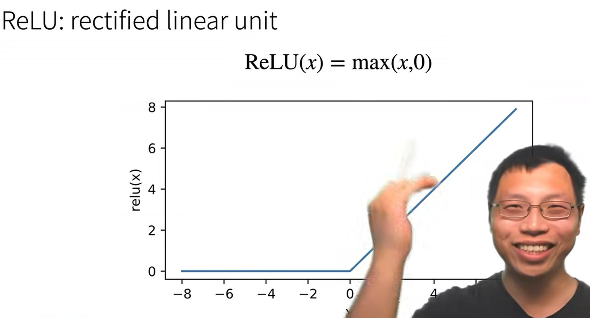

#### K-则交叉验证
 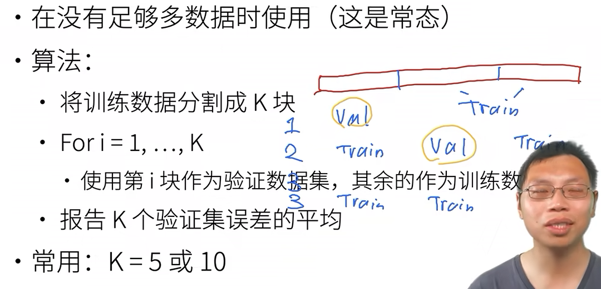

#### 丢弃法：
 动机：增加模型鲁棒性
 做法：在层之间加入噪声
 无偏差加入扰动
 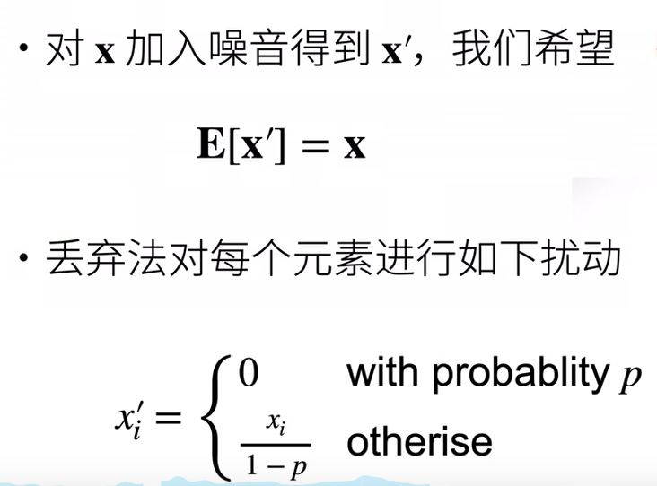
 加在全连接层的输出上，并且可以理解为一个正则项，只在训练的时候使用

#### 模型初始化
<!-- Xavier初始化（没看懂），后面再来看  -->

## 二、卷积神经网路
### 卷积层
- 卷积层对位置敏感
网络大小 nh*hw
卷积核 kh*kw
输出 （nh-kh+1）*（nw-kw+1）
填充 ph，pw
输出（nh-kh+ph+1）*（nw-kw+pw+1）
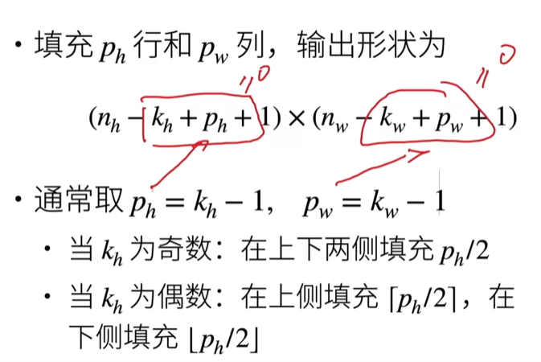
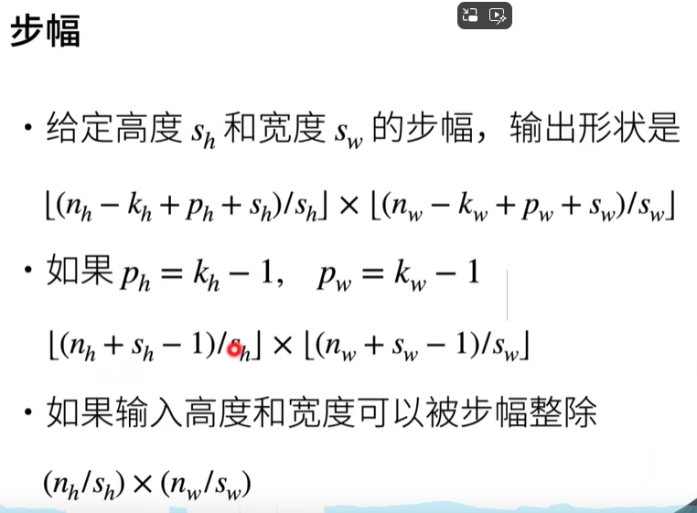
### 池化层
如果size为2并且步长为2，则会高宽减半
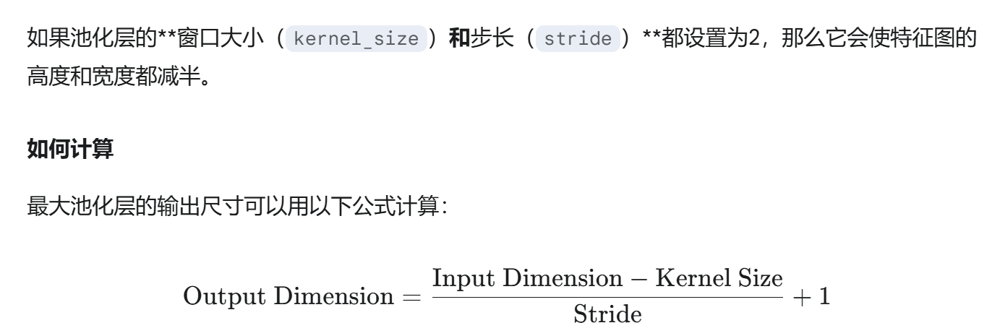

## 三、线代卷积神经网路
### 经典卷积网络-LeNet
卷积神经网路
### AlexNet
更大更深的卷积神经网络
### VGG
将卷积和池化层集成成块来进行复制，打造更深的网络
### NiN
1. 卷积层的参数
ci*co*k²（对每一输入通道对应的每一个输出通道都有一个对应的卷积核）
2. 全连接层的参数
很多
为了解决全连接层参数很多的问题，提出NiN块
- NiN块
一个卷积层和两个1x1的卷积层
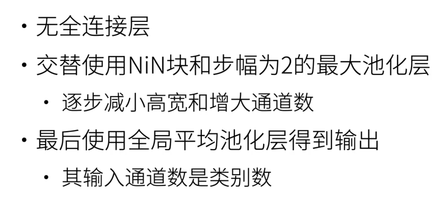
### GoogLeNet
- inception块
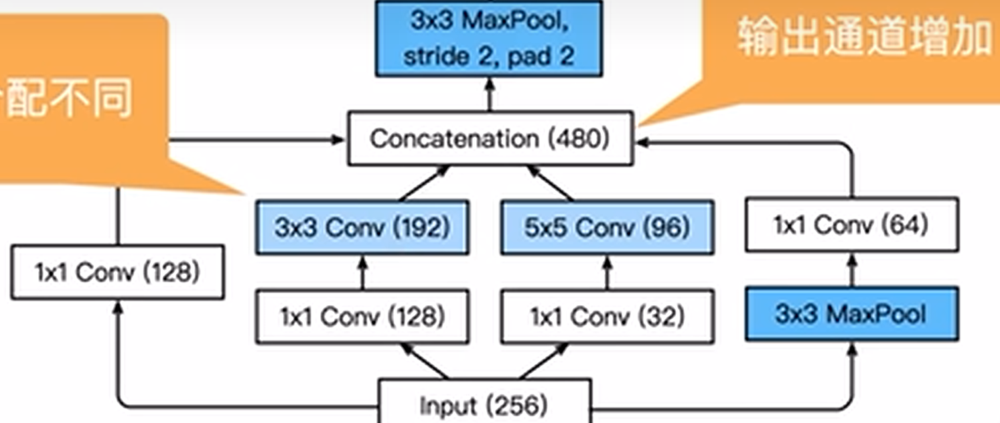
### 批量归一化
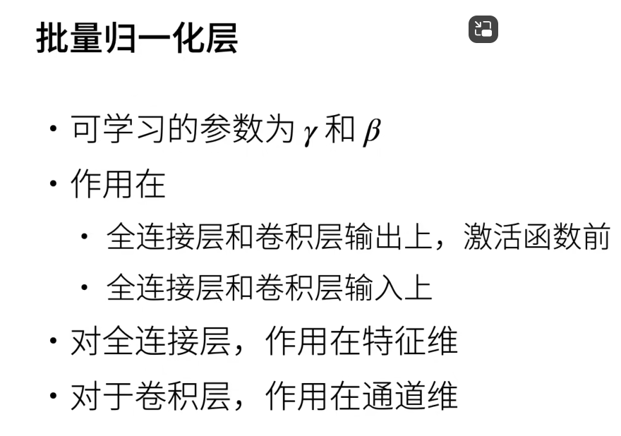

### Resnet
lr, num_epochs, batch_size = 0.05, 10, 256
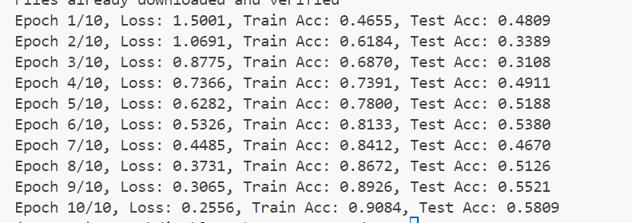
增加epochs到三十次
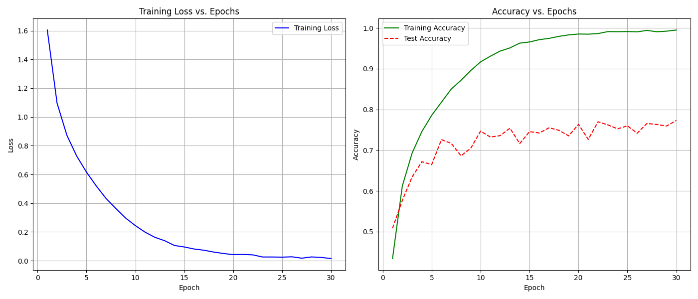

## 三、Transformer
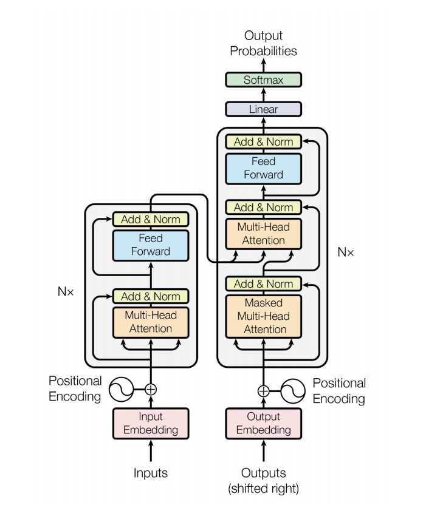
### Multi-Head Attention 多头注意力
